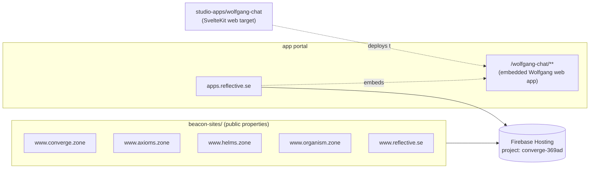

# beacon-sites — Architecture Overview

<!-- @generated:start -->

Public web properties + app portal for Reflective Labs. Per [[../current-system-map|current-system-map]]: "Svelte/SvelteKit projects with Firebase Hosting targets". No top-level `README.md` at the repo root; each site has its own.

## Stack composition

Scan at commit `84769e0`: Markdown 462 files (58.1%), JavaScript 224 (28.2%), TypeScript 54 (6.8%), Svelte 45 (5.7%), Shell 8, Python 2.

Documentation-heavy across all sites (Markdown dominates). Per-site CI config visible (`firebase.json`, `firestore.rules`, `firestore.indexes.json`, `eslint.config.js` per site at e.g. `www.converge.zone/`).

## The 7 site workspaces

Six have source content; one is scaffolded but empty.

| Site | Path | Source files (scan) | Notes |
|---|---|---|---|
| converge.zone | `www.converge.zone/` | 126 | Largest. Public Converge property. |
| axioms.zone | `www.axioms.zone/` | 65 | Public Axiom property. |
| helms.zone | `www.helms.zone/` | 58 | Public Helm property. |
| organism.zone | `www.organism.zone/` | 58 | Public Organism property. |
| apps.reflective.se | `apps.reflective.se/` | 13 | App portal. Per [[../current-system-map|current-system-map]]: Firebase target `marquee-apps`; embeds the Wolfgang web app under `/wolfgang-chat/**`. |
| reflective.se | `www.reflective.se/` | 13 | Main Reflective Labs site. |
| wolfgang.bot | `www.wolfgang.bot/` | 0 | **Scaffolded but empty.** Only contains `.claude/`. Per [[../studio-apps/Architecture - Overview|studio-apps]]: Wolfgang web actually deploys to `apps.reflective.se/wolfgang-chat/**`, not its own domain at this point. Treat `www.wolfgang.bot/` as a reserved slot; not a live target. |

The scan only enumerated the 6 sites with content — `www.wolfgang.bot` is empty and was excluded by the source-file threshold.

## Stack per site

From sample (`www.converge.zone/`): each site is a SvelteKit project with Firebase Hosting deploy config:

- `firebase.json`, `firestore.rules`, `firestore.indexes.json` — Firebase deploy + data plane rules per site
- `functions/` — Firebase Functions (where present)
- `eslint.config.js`, `bun.lock` — Bun-managed JS/TS
- `gate-all.sh` — pre-deploy gate script
- `dist/`, `docs/`, `CLAUDE.md`, `AGENTS.md`, `CHANGELOG.md`, `CODE_OF_CONDUCT.md`, `COLLABORATION.md`, `CONTRIBUTING.md`

The repeated `firestore.rules` per site means **each domain owns its own Firestore data plane and rules**, not a shared one.

## How beacon-sites fits in the stack

Per [[../current-system-map|current-system-map]]: Firebase Hosting targets live under project `converge-369ad` for the public Reflective web properties and the app portal.

## Personas

Inferred from site roles; `confidence: speculation`.

- **Prospect / visitor** — reads converge.zone / axioms.zone / helms.zone / organism.zone / reflective.se to evaluate the platform.
- **Wolfgang user** — logs into `apps.reflective.se` to access Wolfgang Chat web app.
- **Site author** — edits content per site repo, runs the per-site `gate-all.sh` before deploy.
- **Releases owner** — coordinates Firebase deploys across all sites under the `converge-369ad` project.

## Boundary

Owns: public-facing web content, app portal hosting, Firebase Hosting + Firestore rules per site.
Does NOT own: app product code (→ [[../studio-apps/Architecture - Overview|studio-apps]] / [[../marquee-apps/Architecture - Overview|marquee-apps]]), backend logic (→ [[../runtime-runway/Architecture - Overview|runtime-runway]]).

## Cross-references

- [[../current-system-map|Current System Map]]
- [[../../deployment-and-infrastructure|Deployment and Infrastructure]]
- [[../../security-review|Security Review]] (per-site Firebase rules + headers)
- [[../studio-apps/Architecture - Overview|studio-apps]] — Wolfgang web app source
- [[../README|04-architecture]] — domain hub

<!-- @generated:end -->
