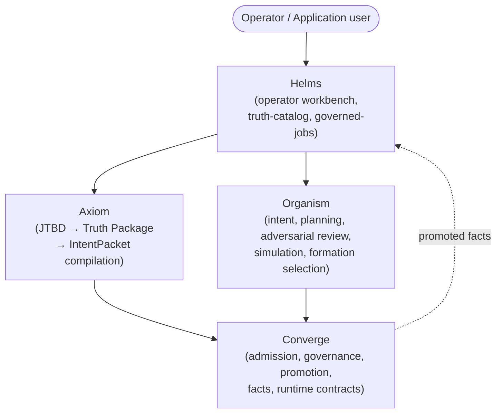

# bedrock-platform — Architecture Overview

<!-- @generated:start -->

Bedrock is the core system base of the Reflective stack. The repository is a coordination shell containing four sibling Rust projects with independent git history and release cadences: [[Architecture - Converge|Converge]], [[Architecture - Organism|Organism]], [[Architecture - Axiom|Axiom]], and [[Architecture - Helms|Helms]]. Bedrock as a whole is what [[../current-system-map|current-system-map]] calls "the core system base"; this overview documents the in-repo composition only.

## Stack composition

Scan at commit `fc7981d` (working tree dirty):

| Sub-project | Path | Kind | Crates | Workspace version | Public interface family |
|---|---|---|---|---|---|
| Converge | `converge/` | Rust workspace | 11 | `3.9.2` | Rust crates `converge-*` + protocol schema |
| Helms | `helms/` | Rust workspace | 35 | `0.2.1` | Rust crates + Tauri desktop + Svelte web + `proto/prio/*/v1` |
| Organism | `organism/` | Rust workspace | 12 | `1.9.3` | Rust crates `organism-*` (libraries only, no bins) |
| Axiom | `axiom/` | Single Rust package | 1 | `0.15.2` | `axiom-truth` crate + `cz` CLI binary |

Source counts: Rust 585 files (43.9%), Markdown 578 (43.4%), JS 87, TS 33, Svelte 29, Shell 16, Python 4.

Version drift vs. [[../current-system-map|current-system-map]] (audited 2026-05-31): Converge 3.9.1→3.9.2, Organism 1.9.1→1.9.3, Axiom 0.15.0→0.15.2. Patch bumps only; structure unchanged.

## How the parts fit together

The four sub-projects compose the governance loop. Helm is the operator-facing surface; the other three are layers below.

Direction of authority (per [[../current-system-map|current-system-map]] boundaries):

- **Converge** owns admission, promotion, facts, criteria evaluation, protocol, runtime, storage contracts. Does not select formations.
- **Organism** owns intent contracts, planning, adversarial review, simulation, formation selection. Does not own promotion authority.
- **Axiom** translates jobs and truths into runtime contracts. Does not select formations or promote facts.
- **Helms** owns trust-transfer surfaces, workbench views, operator-facing consequence. The application layer built on Converge + Organism.

The bedrock workspace itself is *not* a Cargo workspace — each sub-project is its own workspace and was historically a separate repo (Axiom was extracted to its own repo on 2026-05-12, see `Recent structural changes` below).

## Personas

Inferred from README content and the operator-facing framing; not stated in any single source file. `confidence: speculation`.

- **Platform operator** — uses Helm to review, approve, and audit governed jobs.
- **Truth/JTBD author** — uses Axiom (`cz` binary, manifest schema) to compile jobs and truths into deployable contracts.
- **Bedrock contributor** — works inside one or more of the four crate workspaces and needs to understand the boundary they're crossing.
- **Application builder** — consumes Bedrock crates from a sibling repo (`marquee-apps/`, `studio-apps/`) and needs the Converge/Organism/Axiom interface boundary clear.

## Module index

- [[Architecture - Converge|Converge]] — 11 crates, governance kernel
- [[Architecture - Organism|Organism]] — 12 crates, intelligence runtime
- [[Architecture - Axiom|Axiom]] — single `axiom-truth` crate + `cz` CLI
- [[Architecture - Helms|Helms]] — 35 crates, operator workbench (Tauri desktop, Svelte web, proto wire format)

## Recent structural changes

From commit-decision mining at `fc7981d`:

- **2026-05-12 `af63388`** — Axiom extracted to its own repository; gitlink removed and `axiom/` excluded via `.gitignore`. Bedrock now references Axiom by path only when Axiom is checked out as a sibling working tree.
- **2026-05-12 `7623873`** — Gamification sub-project removed; docs and path references updated.

## Cross-references

- [[../current-system-map|Current System Map]] — authoritative cross-workspace responsibilities
- [[../runtime-injection-boundaries|Runtime and Injection Boundary Diagrams]] — how Bedrock components inject into runtime
- [[../applet-runtime-boundaries|Applet Runtime Boundaries]] — where applet behavior lives across Axiom / Helm / apps
- [[../README|04-architecture]] — domain hub
- [[../../converge-business/README|Converge business KB]]
- [[../../organism-business/README|Organism business KB]]

<!-- @generated:end -->
