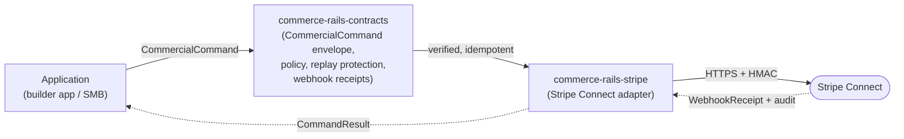

# commerce-rails — Architecture Overview

<!-- @generated:start -->

Reflective-owned business layer for commercial authority. Per its own README:

> *"Reflective Commerce Rails is the Reflective-owned business layer for commercial authority. It exists so builders and SMBs can launch on the Reflective stack without first building billing, entitlement, partner marketplace, revenue-share, payout, refund, dispute, and reconciliation infrastructure."*
> — `commerce-rails/README.md:1-4`

Scan stage: docs-heavy (12 markdown files vs. 2 Rust source files at commit `2e5680f`). Two public crates are defined in `Cargo.toml` and have working surfaces, but the body of the implementation is still small. Treat this overview as a description of the **commercial-authority contract**, not of a deployed runtime.

## Stack composition

- Rust workspace, edition 2024, `rust-version = "1.94"`. Workspace version `0.1.2`.
- **2 crates**, both at `crates/`:

| Crate | Path | Role |
|---|---|---|
| `commerce-rails-contracts` | `crates/commerce-rails-contracts` | The commercial vocabulary: account types, money/identity primitives, command envelopes, policy enums. No external dependencies. |
| `commerce-rails-stripe` | `crates/commerce-rails-stripe` | Stripe Connect adapter implementing the contract surface against the Stripe API (`reqwest`, `hmac`, `sha2`). |

## Contract shape

`commerce-rails-contracts` exports a single coherent vocabulary; the names below are the actual public types at `crates/commerce-rails-contracts/src/lib.rs`:

- **Value primitives:** `CommerceId` (stable identifier), `ProviderObjectRef` (never primary — explicit "provider's id is not our id"), `IdempotencyKey`, `ReplayKey`, `MoneyAmount` (minor units), `CurrencyCode`, `Timestamp`.
- **Accounts:** `ReflectiveAccount`, `CustomerOrg`, `BuilderAccount`, `PartnerAccount` — each carries `provider_refs`; states via `AccountStatus` enum (Pending/Active/Suspended/Closed).
- **Commerce objects:** `AppListing` → `Plan` → `Price` → `Subscription` → `EntitlementGrant`, all keyed by `CommerceId`.
- **Revenue sharing:** `RevenueShareAgreement` → `TransferIntent` → `PayoutObligation`.
- **Command envelope** (`CommercialCommand<T>`): wraps payload with `idempotency_key`, `actor`, `scope`, `origin`, `safety` (webhook verification, replay protection, policy, HITL, audit, reconciliation gates). Result: `CommandResult<T>` carries `status`, `output`, `effects`, `audit_event_id`, `failure`.
- **First gear train** (`PartnerPiggyBackCommand` enum): `ListPartnerApp` → `InstallPartnerApp` → `CreateSubscription` → `GrantEntitlement` → `RecordRevenueShare` → `StagePartnerPayout`.
- **Webhook safety:** `WebhookReceipt`, `WebhookVerification`, `ReplayProtection` enums.

## How the parts fit together

Commerce Rails is the **commercial authority boundary**: only this layer changes billing, entitlement, credit balances, or reconciliation. Apps express intent through `CommercialCommand<T>`; the contracts crate gates execution behind webhook verification, replay protection, and policy. The adapter (`commerce-rails-stripe`) maps the verified intent into Stripe Connect API calls. Stripe is one adapter; the contract is provider-agnostic — additional adapters (e.g., for non-Stripe payouts) can be added without changing the contract surface.

## Personas

Inferred from README and contract shape; `confidence: speculation`.

- **Builder** — publishes an `AppListing` and earns a share via `RevenueShareAgreement` / `PayoutObligation`.
- **SMB / Customer org** — installs an app, subscribes to a `Plan` at a `Price`, receives an `EntitlementGrant`.
- **Reflective operator** — owns reconciliation, dispute handling, and audit of `WebhookReceipt`s.
- **Partner** — a sibling commercial actor surfaced through the `PartnerPiggyBackCommand` gear train.

## Module structure

A single core module (`crates/`) holding 2 sibling crates. The contracts crate is dependency-free; the stripe crate depends on the contracts crate. There is no separate runtime module — Commerce Rails plugs into runtime hosts owned by [[../runtime-runway/Architecture - Overview|runtime-runway]] (see [[../current-system-map|current-system-map]] §Boundaries).

The workspace is documentation-heavy by design at this stage. Architecture documentation lives at `commerce-rails/kb/Architecture/` with: `Executable Command Safety`, `Operating Authority Boundary`, `Rail Terminology`, and `Runtime Runway Commerce Rails Boundary`. Adapter boundary lives at `commerce-rails/kb/Adapters/Stripe Connect Boundary`.

## Boundary

From [[../current-system-map|current-system-map]] §Boundaries:

- Owns: commercial state, billing, entitlement, marketplace, payout, reconciliation.
- Does NOT own: runtime operations (→ [[../runtime-runway/Architecture - Overview|runtime-runway]]).
- Stripe is an **adapter**, not the authority. The authority is the contracts crate.

Per [[../applet-runtime-boundaries|applet-runtime-boundaries]]: commercial actions stay outside applet execution and flow back as facts, receipts, or observations.

## Entry points

No `[[bin]]` targets in either crate at `2e5680f`. Both are libraries to be embedded in runtime hosts.

## Recent structural change

**2026-05-29 (`2e4a0bd`)** — Workspace renamed from "Movement" to "Commerce Rails" and relocated as a direct sibling to [[../runtime-runway/Architecture - Overview|runtime-runway]] (previously nested under an older commercial path). See also [[../../LOG|KB/LOG.md]] 2026-05-29.

## Cross-references

- [[../current-system-map|Current System Map]]
- [[../applet-runtime-boundaries|Applet Runtime Boundaries]]
- [[../README|04-architecture]] — domain hub

<!-- @generated:end -->
