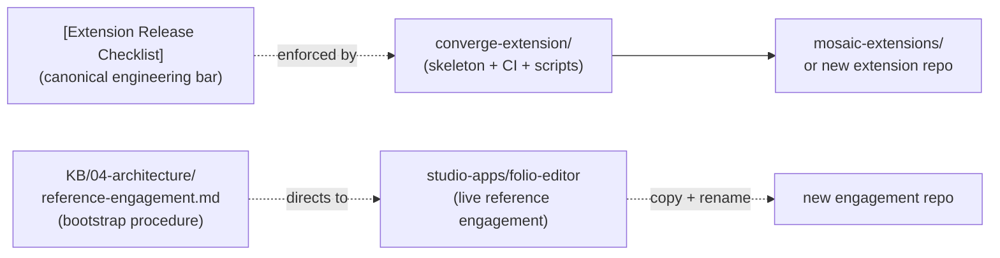

# forge-templates — Architecture Overview

<!-- @generated:start -->

Workspace skeleton for spinning up new Converge-based Mosaic extensions. No top-level `README.md`; the active template carries its own.

As of 2026-06-07, **only one template is active** here: `converge-extension/`. The sibling `converge-engagement/` template was archived in favour of using `studio-apps/folio-editor` as the live reference engagement — see [[../reference-engagement|reference-engagement.md]] and the [[../decisions/2026-06-07-retire-engagement-template|retirement ADR]].

## Stack composition

Scan at commit `e3359ad` (dirty): Markdown 20 files (69.0%), Rust 6 (20.7%), Shell 2, Python 1. Numbers include the archived `converge-engagement/` content which still sits on disk under a `_ARCHIVED.md` marker.

## The active template

### converge-extension — `converge-extension/`

Per its README:

> *"`{{extension}}` is a Converge extension. It depends on stable Converge contracts (`converge-pack`, `converge-model`, `converge-provider-api`) and ships an implementation downstream of the foundation."*
> — `forge-templates/converge-extension/README.md:6-8`

For: starting a new [[../mosaic-extensions/Architecture - Overview|mosaic-extension]] (Arbiter, Crucible, Ferrox, Manifold, Mnemos, Prism, Soter all match this shape).

**Release ritual** declared by this template (`converge-extension/README.md:16-25`) — every release tag must pass five gates in order, anchored on the canonical [Extension Release Checklist](https://github.com/Reflective-Lab/converge/blob/main/kb/Standards/Extension%20Release%20Checklist.md):

1. `just security-audit` — clean supply chain
2. `just coverage` — ≥ 80% per crate, no regression
3. `just performance-profile` — baseline locked (with `PERF_BASELINE` env)
4. (further gates referenced in the checklist)
5. (further gates referenced in the checklist)

This is the same 80% coverage floor that [[../atelier-showcase/Architecture - Overview|atelier-showcase]]'s `coverage.yml` enforces.

**Floor:** Converge >= 3.8.1, MSRV 1.94.0, Edition 2024, `unsafe_code = "forbid"` (per `CLAUDE.md`).

## How forge-templates fits in the stack

The split: extensions still bootstrap from a template (the template carries CI + release-ritual + benchmark tooling that's not yet in any individual extension). Engagements bootstrap from a live reference repo (folio-editor) per [[../reference-engagement|reference-engagement.md]] — no static template to drift.

## Personas

`confidence: speculation`.

- **Extension author** — copies `converge-extension/` to start a new Mosaic family; meets the release-checklist gates before tagging.

(The "engagement lead" persona that previously copied `converge-engagement/` now follows [[../reference-engagement|reference-engagement.md]] — copy folio-editor and rename.)

## Boundary

Owns: extension workspace skeleton + working CI workflows + release-ritual enforcement scripts + criterion benchmark baseline tooling. Does NOT own: the live extension code (each copy detaches and lives on its own); engagement scaffolding (→ [[../reference-engagement|reference-engagement.md]] + [[../studio-apps/Architecture - Overview|studio-apps/folio-editor]]).

## Cross-references

- [[../current-system-map|Current System Map]]
- [[../mosaic-extensions/Architecture - Overview|mosaic-extensions]] — all mosaic families follow the extension template's shape
- [[../studio-apps/Architecture - Overview|studio-apps]] — `folio-editor` ("Newspaper") is the reference engagement this template was lifted from
- [[../README|04-architecture]] — domain hub

<!-- @generated:end -->
