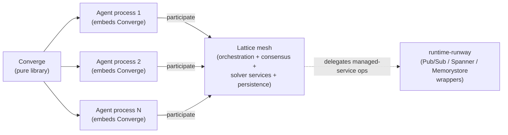

# lattice-mesh — Architecture Overview

<!-- @generated:start -->

Per its own `AGENTS.md` (canonical doc — there is no `README.md` at this stage):

> *"Reflective Lattice is the distributed execution mesh for the Converge ecosystem. Converge is a pure library — Lattice is the host environment where Converge-based agents live and run."*
> — `lattice-mesh/AGENTS.md:5`

> *"Converge runs as a library inside agents that participate in the Lattice mesh. Lattice provides the transport substrate and compute environment. Agents are just processes — Lattice makes them distributed."*
> — `lattice-mesh/AGENTS.md:30`

## Status: planning / docs-only

Scan at commit `a46b454` returned **0 source modules**, only 4 markdown files. There is no Rust workspace, no `Cargo.toml`, no `docker/` or `k8s/` directory at the repo root yet. The repo currently consists of:

- `AGENTS.md` — canonical project documentation
- `CLAUDE.md` — Claude Code entrypoint, points at `AGENTS.md`
- `kb/` — knowledgebase (kb/Architecture/ topology, service contracts, node roles; kb/Planning/ milestones, ADRs)
- `.git/`, `.claude/`, `.gitignore`

Treat lattice-mesh as **a declared boundary and milestone list, not an implemented runtime**. The repo says where code will go (`docker/`, `ops/`, `k8s/`) but does not yet contain it.

Upstream repo per `AGENTS.md:3`: `https://github.com/Reflective-Lab/lattice` — this local checkout may be the planning fork; treat as authoritative for the boundary, not necessarily for implementation state.

## Declared boundary

What Lattice owns (`AGENTS.md:7-13`):

- **Orchestration** — Docker Compose, container lifecycle, service mesh
- **Consensus** — embedded Rust (Organism HITL quorum); in-process distributed algorithm, not a managed service
- **Suggestors** — self-contained solver services (Ferrox SAT, future GPU workers)
- **Persistence** — databases, vector stores, object storage
- **Deployment** — node provisioning, health, scaling

What Lattice does NOT own (`AGENTS.md:15-20`):

- Cognitive engine → [[../bedrock-platform/Architecture - Converge|Converge]]
- Truth pipeline, governance, Cedar policies → [[../bedrock-platform/Architecture - Converge|Converge]]
- Agent domain packs → [[../bedrock-platform/Architecture - Organism|Organism]]
- Binary packaging, local LLM, **managed service wrappers** (Pub/Sub, Spanner, Memorystore) → [[../runtime-runway/Architecture - Overview|runtime-runway]]

## Runtime Runway / Lattice boundary

Quoted from `AGENTS.md:22-27`:

> *"Runtime Runway = thin wrappers over GCP managed services (Pub/Sub for messaging, Spanner for distributed ACID state, Memorystore for distributed locks).*
>
> *Lattice = in-process distributed algorithms that cannot be delegated to a managed service — principally the Organism HITL quorum via embedded Rust consensus."*

The split: anything GCP can manage → Runway. Anything that has to run in-process (HITL quorum, embedded consensus) → Lattice.

## How it will fit (target shape)

Future implementation will live in `docker/`, `ops/`, `k8s/` per `CLAUDE.md:9`.

## Personas (target)

Inferred from declared boundary; `confidence: speculation`.

- **Mesh operator** — runs `just up` / `just down` / `just status` (`AGENTS.md:39-45`); owns Docker Compose + node health.
- **Solver-service author** — adds a self-contained solver to the suggestors layer (e.g., Ferrox SAT, future GPU workers).
- **Consensus engineer** — works inside the in-process Organism HITL quorum (embedded Rust consensus).

## Cross-references

- [[../current-system-map|Current System Map]] (`Lattice Mesh` is named there as a runtime owner)
- [[../bedrock-platform/Architecture - Converge|Converge]] — the library Lattice hosts
- [[../bedrock-platform/Architecture - Organism|Organism]] — owner of the HITL quorum that Lattice runs in-process
- [[../runtime-runway/Architecture - Overview|runtime-runway]] — sibling that owns the managed-service path
- [[../README|04-architecture]] — domain hub

<!-- @generated:end -->
