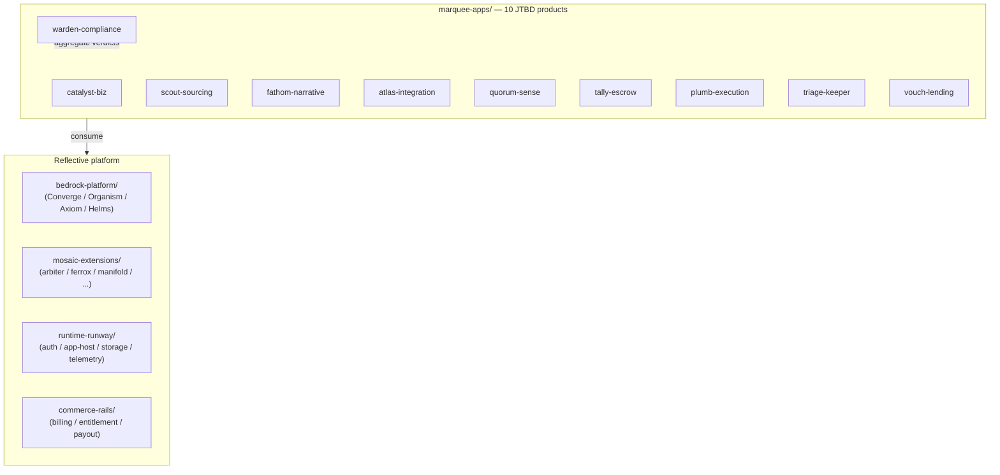

# marquee-apps — Architecture Overview

<!-- @generated:start -->

Per its own README:

> *"Thin, JTBD-oriented end-user product surfaces built on the Reflective platform stack."*
> — `marquee-apps/README.md:3`

Meta-workspace containing **10 sub-app workspaces**, each independently versioned with its own `Cargo.toml`, `README.md`, and (where applicable) Tauri/Svelte shell. No top-level Cargo workspace.

## Stack composition

Scan at commit `b345d5b`: Markdown 267 files (51.1%), Rust 115 (22.0%), JavaScript 68 (13.0%), TypeScript 40 (7.7%), Svelte 25 (4.8%), Shell 7.

Documentation-heavy at this stage. Several sub-apps are Tauri/SvelteKit desktop+web; one is KB-first.

## The 10 sub-apps

All purposes quoted from each sub-app's `README.md` (`confidence: stated`).

| Sub-app | Type | Purpose |
|---|---|---|
| `catalyst-biz` | Tauri/SvelteKit | "SMB business-ops app: sales, marketing, billing, booking — orchestrated as JTBD flows with human-in-the-loop (HITL) approval gates." |
| `scout-sourcing` | Rust workspace + Tauri/SvelteKit | "Governed sourcing & vendor-selection app: compare vendors, promote evidence through Converge gates, and produce decisions that can be audited." |
| `fathom-narrative` | Rust workspace | "Temporal-narrative analyzer for corporate disclosures. It watches how the language of risk changes across a company's filings over time." |
| `atlas-integration` | Rust workspace + Tauri/SvelteKit | "OmniStack AI — post-acquisition integration room for codebase synergy. Maps acquired repositories, identifies duplicated platform capabilities, turns overlap into reviewable evidence." |
| `quorum-sense` | Rust workspace | "Continuous organizational sensemaking: live adaptive inquiry, fuzzy hypothesis formation, and collective signal aggregation for early reality perception." |
| `tally-escrow` | Rust workspace | "Bilateral escrow & conditional handoff — governed custody for asymmetric-finality exchanges (domains, credentials, milestone services, M&A earnouts)." |
| `plumb-execution` | Rust workspace + Tauri/SvelteKit | "Closed-loop strategy execution app: keep strategy and operating reality plumb, detect drift early, and route corrective decisions through governed promotion gates." |
| `warden-compliance` | Single Rust crate + Tauri/SvelteKit | "Compliance officer's console: author regulatory rule registry, aggregate verdicts streamed from every regulated marquee app, and run shadow analyses of rule changes." |
| `triage-keeper` | KB-first (minimal impl) | "Maintenance and sustaining service for external software solutions — automated dependency monitoring, proactive security patching, legacy refactoring." |
| `vouch-lending` | Rust workspace | "Lending-domain app seed: applicant fixtures, underwriting workflow, compliance voice, and decision rationale." |

## How marquee-apps fits in the stack

Each sub-app is a **thin JTBD surface** on top of the platform — domain logic per app, but governance/runtime/commerce shared. Special role: `warden-compliance` aggregates compliance verdicts streamed from every regulated marquee app.

## Personas

Inferred from sub-app domains; `confidence: speculation`.

- **SMB operator** (catalyst-biz, plumb-execution)
- **Procurement / sourcing manager** (scout-sourcing, vouch-lending)
- **M&A / integration lead** (atlas-integration, tally-escrow)
- **Compliance officer** (warden-compliance, triage-keeper)
- **Researcher / analyst** (fathom-narrative, quorum-sense)

## Module index (sub-app deep-dives)

Not yet written. Each sub-app warrants its own per-module architecture set. To add one, run `/obsidian-architect` against `marquee-apps/<sub-app>/` and direct output to `KB/04-architecture/marquee-apps/<sub-app>/`. Suggested priority (by source-file count):

- `scout-sourcing` (240 files) — likely the largest sub-app
- `quorum-sense` (89)
- `atlas-integration` (79)
- `fathom-narrative` (64)
- `catalyst-biz` (62)
- `plumb-execution` (55)
- `vouch-lending` (41)
- `warden-compliance` (40)
- `triage-keeper` (37)
- `tally-escrow` (38)

## Boundary

Owns: thin JTBD product surfaces, per-app domain state machines, app-specific adapters that emit observations.
Does NOT own: governance contracts (→ [[../bedrock-platform/Architecture - Converge|Converge]]), commercial state (→ [[../commerce-rails/Architecture - Overview|commerce-rails]]), runtime plumbing (→ [[../runtime-runway/Architecture - Overview|runtime-runway]]), specialist capabilities (→ [[../mosaic-extensions/Architecture - Overview|mosaic-extensions]]).

Per [[../applet-runtime-boundaries|applet-runtime-boundaries]]: product apps own their domain state machines, app-specific adapters, and emitted observations. They consume applet manifests from Axiom and project state into operator-facing surfaces.

## Cross-references

- [[../current-system-map|Current System Map]]
- [[../applet-runtime-boundaries|Applet Runtime Boundaries]]
- [[../bedrock-platform/Architecture - Overview|bedrock-platform]] — the platform these apps consume
- [[../studio-apps/Architecture - Overview|studio-apps]] — sibling for creative/research apps
- [[../mobile-apps/Architecture - Overview|mobile-apps]] — native iOS/Android surfaces for marquee + studio
- [[../README|04-architecture]] — domain hub

<!-- @generated:end -->
