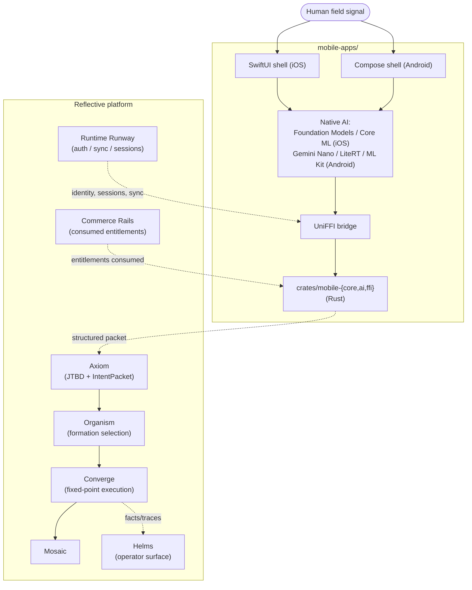

# mobile-apps — Architecture Overview

<!-- @generated:start -->

Native iOS + Android product lab for the Reflective stack. Per its own README:

> *"Native mobile surfaces for the Reflective stack. This repository is the mobile product lab for Reflective. It exists to turn the Marquee and Studio app portfolios into first-class iOS and Android experiences without losing the governed Rust platform underneath them."*
> — `mobile-apps/README.md:3-7`

Repo status (per `README.md:230-232`): "This repo is public and intentionally early. It is a product lab plus native foundation, not a finished app store product."

## Stack composition

Scan at commit `10f6839`: Swift 93 files (53.1%), Markdown 41 (23.4%), Kotlin 31 (17.7%), Rust 6 (3.4%), Shell 3, C 1.

Three-language native stack: **SwiftUI** for iOS (`README.md:11`), **Kotlin/Compose** for Android (`README.md:12`), **Rust** below the UI line for shared application logic (`README.md:13`), **UniFFI** as the bridge (`README.md:16`).

## Declared product principle

Quoted from `mobile-apps/README.md:35-37`:

> *"The mobile app is the layer between raw human experience and governed logic. It captures intent, normalizes it with local AI, asks for consent, then hands a structured packet to the Rust/platform stack."*

And the deliberate scope of the mobile AI layer (`README.md:118-121`):

> *"It is deliberately narrow. It may summarize, extract, rewrite, transcribe, and preprocess. It must not silently decide, promote facts, run product invariants, or bypass consent."*

That last sentence is the boundary. Everything authoritative happens on the platform; mobile owns capture + consent + on-device preprocessing.

## Current shape

From `mobile-apps/README.md:157-177` (only `apps/marquee/` is in this scan; the rest is template/scaffold and platform AI plumbing):

```
apps/
  marquee/
    quorum-sense/          ← first mobile candidate and fixture harness
  studio/
    inkling-notes/         ← studio candidate
    wolfgang-chat/         ← studio candidate
crates/
  mobile-core/             portfolio contract and Quorum workflow fixture logic
  mobile-ai/               AI execution routing policy
  mobile-ffi/              UniFFI-facing facade
schemas/
  quorum-mobile.udl        planned UniFFI contract
templates/
  native-shells/
    ios/                   minimal SwiftUI template
    android/               minimal Compose template
docs/
  adr/                     architecture decisions
  architecture/            platform and product boundaries
```

The scan classified `apps/marquee/` as the single "core" module (12 files) — that's the first concrete app (Quorum field signal capture). Other directories exist as scaffolds and have low/no source content yet.

## The first concrete workflow

Quoted from `README.md:181-187`:

> *"voice/text/photo input → local draft → user consent → queued append event → online sync to Quorum inquiry thread"*

Driving artifacts (`README.md:189-193`):

- `apps/marquee/quorum-sense/fixtures/field-signal-capture.v1.json`
- `schemas/quorum-mobile.udl`
- `docs/architecture/quorum-sense-boundaries.md`

## Target app coverage (declared, not yet implemented)

From `mobile-apps/README.md:48-77` — the explicit mapping from `marquee-apps/` and `studio-apps/` to mobile angles:

**Marquee candidates (10):** `quorum-sense`, `atlas-integration`, `tally-escrow`, `vouch-lending`, `scout-sourcing`, `plumb-execution`, `triage-keeper`, `catalyst-biz`, `fathom-narrative`, `warden-compliance`.

**Studio candidates (5):** `inkling-notes`, `wolfgang-chat`, `folio-editor`, `moosemen-writer`, `wykkid-preso`.

I.e. 1:1 with [[../marquee-apps/Architecture - Overview|marquee-apps]] (10) + [[../studio-apps/Architecture - Overview|studio-apps]] (5).

## How mobile fits in the stack



## Personas

Quoted/inferred from `README.md`; `confidence: stated` for stack roles, `speculation` for personas.

- **Field operator** — captures raw signal (voice/photo/text) into Quorum or another marquee app; consent-driven.
- **Mobile contributor** — works in Swift, Kotlin, or Rust below the UI line.
- **Native-AI engineer** — owns the on-device routing decision (Foundation Models / Core ML on iOS; Gemini Nano / LiteRT / ML Kit on Android).

## CI

`mobile-apps/.github/workflows/`:

- `ci.yml` — Rust format, clippy, tests, docs, scaffold checks, and the iOS shell build (`README.md:221-223`).
- `release-preflight.yml` — same gates plus packaging the current scaffold as an artifact (`README.md:225-226`).

Android CI is **not yet a hard gate** (`README.md:227-228`) — needs a machine with JDK 17, Android SDK 35, working emulator first.

## Legacy artifacts

Per `README.md:235-237`: old Converge and Wolfgang mobile skeletons live under `archive/legacy-placeholders/` for reference only. Not the current direction.

## Boundary

Owns: native capture, on-device AI preprocessing, consent gates, structured packet handoff to the platform.
Does NOT own: governance, fact promotion, billing semantics, product invariants. From `README.md:120-121`: "It must not silently decide, promote facts, run product invariants, or bypass consent."

## Cross-references

- [[../current-system-map|Current System Map]]
- [[../marquee-apps/Architecture - Overview|marquee-apps]] — desktop/web siblings; 10 target mobile candidates
- [[../studio-apps/Architecture - Overview|studio-apps]] — desktop/web siblings; 5 target mobile candidates
- [[../bedrock-platform/Architecture - Axiom|Axiom]] — receiver of mobile-produced IntentPackets
- [[../runtime-runway/Architecture - Overview|runtime-runway]] — sessions, sync, identity
- [[../README|04-architecture]] — domain hub

<!-- @generated:end -->
