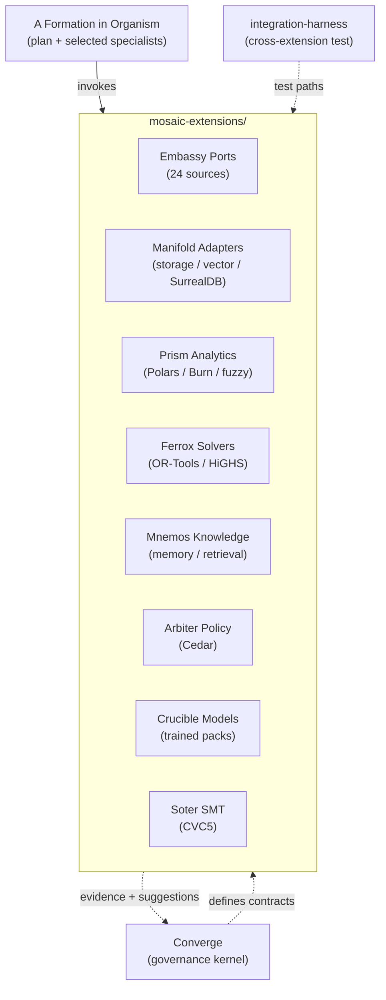

# mosaic-extensions — Architecture Overview

<!-- @generated:start -->

Reusable specialist capability families for the Reflective stack. Per its own README:

> *"Mosaic Extensions. Reusable specialist capability families for the Reflective stack. Mosaic keeps Converge small and stable while still letting formations use strong policy engines, trained models, source-specific ports, optimization solvers, generic providers, memory, analytics, and SMT evidence."*
> — `mosaic-extensions/README.md:1-7`

Eight specialist capability families, each its own Rust workspace, plus one cross-extension integration harness. All capabilities depend on Converge contracts (`converge-pack`, `converge-core`, `converge-provider`) and never own product consequence.

## Stack composition

Scan at commit `1bad671`:

- Rust 411 files (67.6%), Markdown 185 (30.4%), Python 6, C++ 3, C 3 (the C/C++ are FFI shims for solvers: CVC5, OR-Tools, HiGHS).
- 8 capability workspaces + 1 integration harness.
- Largest by source count: `embassy-ports` (140), `manifold-adapters` (69), `prism-analytics` (56), `ferrox-solvers` (54).

## Capability families (8 cores)

Each is a Converge **Suggestor** — it proposes evidence or capabilities through Converge-shaped contracts and does not own product consequence (see [[../current-system-map|current-system-map]] §Boundaries).

| Family | Path | What it owns | Module note |
|---|---|---|---|
| Embassy Ports | `embassy-ports/` | Source-specific connector ports (24 ports: LinkedIn, SEC EDGAR, Bolagsverket, GLEIF, VIES, OFAC SLS, EU sanctions, SAM.gov, USASpending, TED, Skatteverket, USPTO, Crunchbase, GitHub, PubMed, arXiv, OpenAlex, Wikidata, Companies House, SCB, EPO, Commerce CSL, pack) | [[Architecture - Embassy-ports]] |
| Manifold Adapters | `manifold-adapters/` | Generic adapter implementations: object storage, vector stores (LanceDB), SurrealDB, HF Hub | [[Architecture - Manifold-adapters]] |
| Prism Analytics | `prism-analytics/` | Closed-form analytics + inference Suggestors (Polars, Burn, fuzzy inference, ndarray) | [[Architecture - Prism-analytics]] |
| Ferrox Solvers | `ferrox-solvers/` | Constraint solving as a Suggestor (OR-Tools, HiGHS via FFI) | [[Architecture - Ferrox-solvers]] |
| Mnemos Knowledge | `mnemos-knowledge/` | Knowledge, recall, retrieval, memory (gRPC, OpenAI embeddings) | [[Architecture - Mnemos-knowledge]] |
| Arbiter Policy | `arbiter-policy/` | Cedar-backed authorization gates + symbolic compiler, delegation tokens | [[Architecture - Arbiter-policy]] |
| Crucible Models | `crucible-models/` | Trained-model packs + training pipeline (Burn, linfa) | [[Architecture - Crucible-models]] |
| Soter SMT | `soter-smt/` | SMT-backed safety + policy assurance (CVC5 via FFI) | [[Architecture - Soter-smt]] |

### Support (single-line)

- `integration-harness/` — 3 source files; **support, not a capability**. Single package `mosaic-integration-harness` that depends on arbiter, crucible, mnemos, prism, and soter by path; executable cross-extension checks for the extensions container.

## How the parts fit together

Each capability depends on Converge's contract crates (`converge-pack`, `converge-core`, `converge-provider`, and family-specific ones like `converge-fuzzy-inference` for Prism). They cross only through `mosaic-integration-harness`, never directly.

## Personas

Inferred from README and capability shape; `confidence: speculation`.

- **Formation author** — selects which capabilities a formation needs and composes them inside Organism.
- **Source adapter author** — adds a new port under `embassy-ports/crates/` (one crate per source).
- **Policy/SMT engineer** — writes Cedar policies for Arbiter or SMT constraints for Soter.
- **ML practitioner** — trains and packs models in `crucible-models`; runs inference through Burn/llama.cpp paths.

## Naming convention

The names (embassy, manifold, prism, ferrox, mnemos, arbiter, crucible, soter) read as a deliberate set of archetypes. **`confidence: speculation` — no explicit explanation appears in the root README or visible architecture documentation.** Inference from semantics:

- **embassy** — ports of contact with the outside world
- **manifold** — generic surface adapters
- **prism** — refracts data into insight (analytics)
- **ferrox** — iron / solver strength (Latin root)
- **mnemos** — memory (Greek)
- **arbiter** — judgment / authorization
- **crucible** — forge for refining models
- **soter** — protection / safety (Greek)

Treat the names as fixed identifiers; the etymological reading above is unofficial.

## Boundary

From [[../current-system-map|current-system-map]] §Boundaries: Mosaic specialists propose evidence or capabilities through Converge-shaped contracts; they do not own product consequence. Each family is independent: no Mosaic crate directly depends on another Mosaic crate at the workspace level — they only meet inside the `integration-harness` test surface.

## Recent structural changes

From commit-decision mining at `1bad671`:

- **2026-05-21 (`402e5c2`)** — `Fake` → `Scripted` rename across Soter and Manifold violation handling; closes Soter + Manifold violations. Test/spec doubles previously named `Fake*` are now `Scripted*`.
- **2026-05-16 (`39c054d`)** — Dropped a stale `[patch.crates-io]` block from `integration-harness/Cargo.toml`; the harness now resolves dependencies through the normal workspace path.

## Cross-references

- [[../current-system-map|Current System Map]]
- [[../runtime-injection-boundaries|Runtime and Injection Boundary Diagrams]]
- [[../applet-runtime-boundaries|Applet Runtime Boundaries]]
- [[../bedrock-platform/Architecture - Overview|bedrock-platform]] — the kernel + intelligence runtime Mosaic plugs into
- [[../README|04-architecture]] — domain hub

<!-- @generated:end -->
