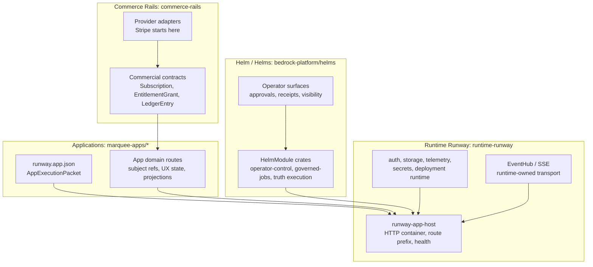
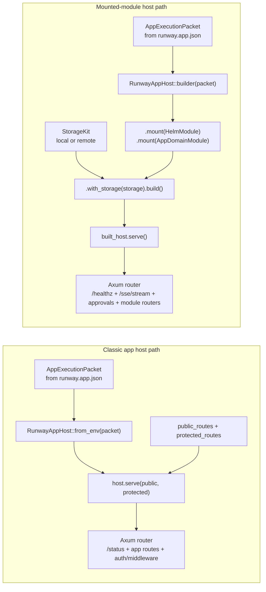
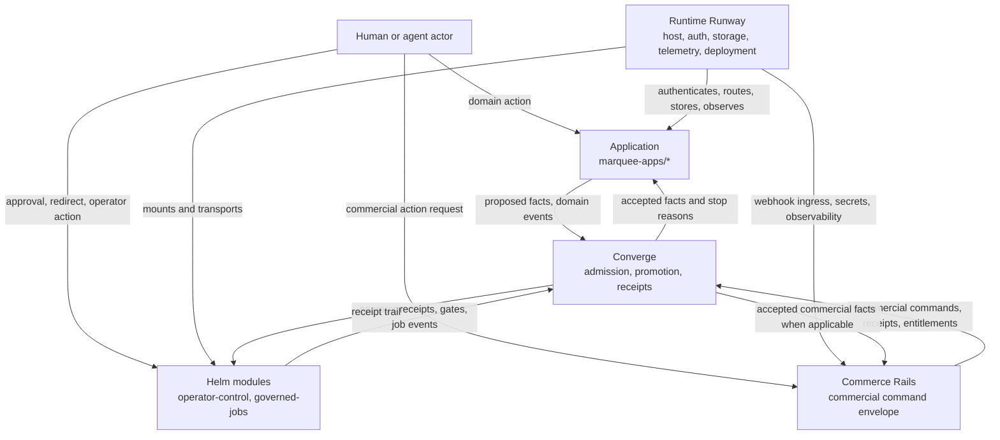
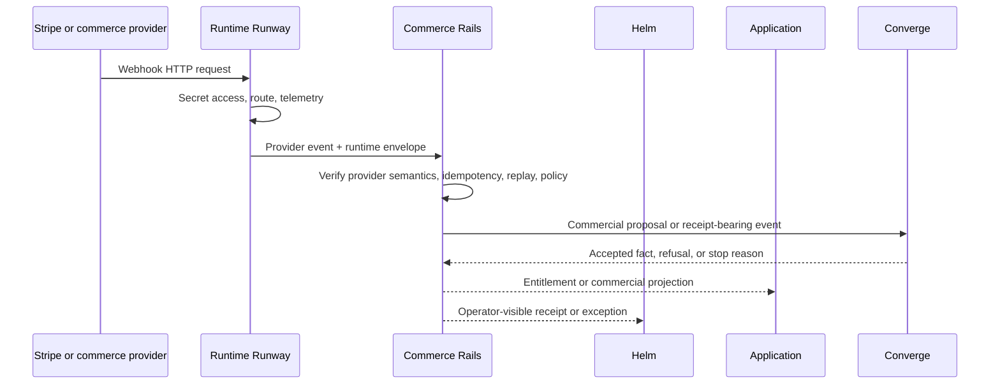
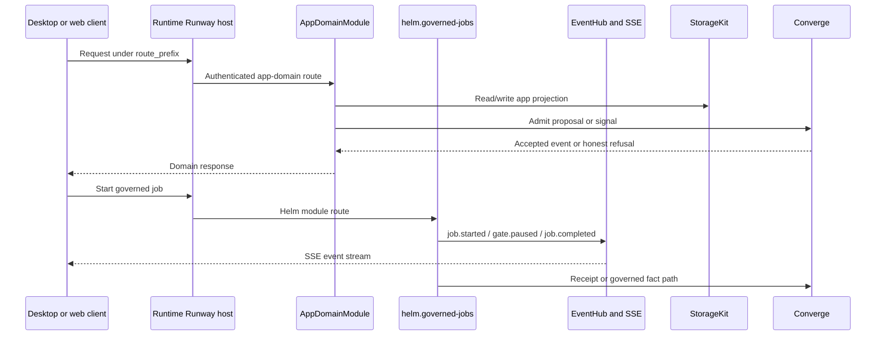

# Runtime and Injection Boundary Diagrams

Last audited: 2026-06-01.

This page draws the current shape around four recurring participants:

- **Application** means a product workspace under `marquee-apps/*`.
- **Helm / Helms** means the operator and trust-transfer surface in
  `bedrock-platform/helms`.
- **Commerce Rails** means Reflective commercial authority in `commerce-rails`.
- **Runtime Runway** means the operational runtime substrate in
  `runtime-runway`.

The diagrams distinguish code ownership from runtime injection. A dependency may
be present in a process without owning the meaning of the domain event that moves
through it.

## Code Homes



Rules:

- Apps own product-domain meaning and app-specific projections.
- Helm owns operator trust-transfer modules and receipt-oriented views.
- Commerce Rails owns commercial state and commercial consequences.
- Runtime Runway owns the container and operational services. It does not own
  app, Helm, or commercial semantics.

## Runtime Host Composition

Two host shapes are live in code today.



Current app examples:

- Atlas and Quorum use the mounted-module path and wrap their app-domain routes
  as `HelmModule` implementations.
- Catalyst, Tally, Plumb, Fathom, Scout, Triage, Vouch, and Warden still use the
  classic app host path or packet-first declarations.

## Injected Handles

The implemented `HostContext` is intentionally small today:

```text
HostContext {
  packet: Arc<AppExecutionPacket>,
  storage: StorageKit,
  realtime: EventHubHandle,
}
```

```mermaid
flowchart TB
    Host["RunwayAppHost builder\nowns EventHub and storage handle"]
    Ctx["HostContext"]
    Packet["packet: AppExecutionPacket\napp id, route prefix, declared boundaries"]
    Storage["storage: StorageKit\nlocal or remote event/document stores"]
    Realtime["realtime: EventHubHandle\nbounded event broadcast + SSE stream"]

    HelmJob["helm.governed-jobs"]
    HelmOps["helm.operator-control"]
    AppModule["app domain module\nAtlasDomainModule, QuorumDomainModule"]

    Host --> Ctx
    Ctx --> Packet
    Ctx --> Storage
    Ctx --> Realtime

    Ctx -->|init(ctx)| HelmJob
    Ctx -->|init(ctx)| HelmOps
    Ctx -->|init(ctx)| AppModule

    HelmJob -->|publishes typed envelopes| Realtime
    HelmOps -->|publishes typed envelopes| Realtime
    AppModule -->|persists domain state| Storage
```

Important constraint: auth, secrets, and telemetry are Runtime Runway concerns,
but they are not all `HostContext` fields in the current code. Some app-domain
modules still read auth configuration from environment and apply `AuthLayer`
inside their router. That is an implementation transition, not a semantic
license for product code to own runtime identity.

## Consequence Lanes



Read the arrows by authority:

- Runtime Runway can route, authenticate, persist, and observe. It cannot decide
  what a commercial event means.
- Commerce Rails can accept commercial state. It cannot decide canonical login,
  deployment, or app runtime topology.
- Helm can ask for, show, and record operator trust transfer. It cannot promote
  a fact by itself.
- The Application can own product workflow and presentation. It should not
  smuggle runtime, operator, or commercial authority into local strings.

## Commercial Ingress Split



The provider transport crosses Runtime Runway. The commercial meaning belongs to
Commerce Rails. App access to the resulting capability should use typed
entitlement or subscription state, not a provider-specific string.

## Application Plus Helm Example



The app and Helm module can share a process, storage handle, and realtime hub.
That does not merge their authority. The route owner in `runway.app.json` should
still say whether a route is `app-domain` or `helm-module`.

## Boundary Checklist

Before adding a new cross-layer dependency, answer these questions:

1. Is this operational state? Put it behind Runtime Runway.
2. Is this commercial state or commercial consequence? Put it behind Commerce
   Rails.
3. Is this operator trust transfer, approval, redirect, or receipt visibility?
   Put it in Helm.
4. Is this product-specific workflow, projection, or subject model? Keep it in
   the Application.
5. Is this admission, promotion, fact integrity, or governed convergence? Route
   it through Converge.
6. Is a string carrying semantics that should be a closed set, bounded number,
   typed actor, typed source, typed route owner, typed entitlement, or typed
   event? Stop and add the type before wiring the boundary.
