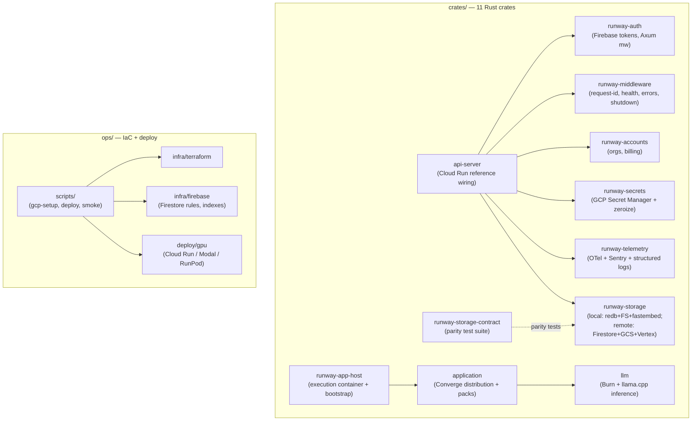

# runtime-runway — Architecture Overview

<!-- @generated:start -->

Distribution, deployment, and infrastructure for the Converge stack. Per its own README:

> *"Reflective Runtime Runway / Distribution, deployment, and infrastructure for the Converge stack. / Runtime Runway owns everything needed to run, package, and deploy Reflective apps that embed Converge."*
> — `runtime-runway/README.md:1-3`

Rust workspace at version `3.4.2`, 11 crates, with operational assets (Terraform, Firestore rules, GCP scripts, GPU deploy configs) living alongside under `ops/`.

## Stack composition

Scan at commit `012b81b`:

- Rust 127 files (60.5%), Markdown 42 (20.0%), JavaScript 20, Shell 19, Python 2.
- Rust workspace at `crates/` (11 members).
- Ops + IaC at `ops/`.
- CI: 5 workflows present (`ci`, `contract`, `contract-staging`, `release`, `security`).
- No top-level Dockerfile or Makefile in this scan; deploy is orchestrated via the scripts in `ops/scripts/`.

## Converge pinning

`Cargo.toml:28-42` pins **15** `converge-*` crates to the `v3.4.0` git tag on `github.com/Reflective-Lab/converge`:

```
converge-model       = { git = ".../converge", tag = "v3.4.0" }
converge-pack        = { git = ".../converge", tag = "v3.4.0", features = ["strum"] }
converge-protocol    = { git = ".../converge", tag = "v3.4.0" }
converge-kernel      = { git = ".../converge", tag = "v3.4.0" }
converge-client      = { git = ".../converge", tag = "v3.4.0" }
converge-core        = { git = ".../converge", tag = "v3.4.0" }
converge-provider    = { git = ".../converge", tag = "v3.4.0" }
converge-provider-api= { git = ".../converge", tag = "v3.4.0" }
converge-domain      = { git = ".../converge", tag = "v3.4.0" }
converge-experience  = { git = ".../converge", tag = "v3.4.0" }
converge-knowledge   = { git = ".../converge", tag = "v3.4.0" }
converge-optimization= { git = ".../converge", tag = "v3.4.0" }
converge-analytics   = { git = ".../converge", tag = "v3.4.0" }
converge-policy      = { git = ".../converge", tag = "v3.4.0" }
converge-storage     = { git = ".../converge", tag = "v3.4.0", default-features = false }
```

Local SDK work uses a `.cargo/config.toml` path override via `just use-local-converge` (`Cargo.toml:25-27`).

Note: local Converge workspace is `3.9.2` (see [[../bedrock-platform/Architecture - Converge|Converge]]). Runtime Runway is intentionally lagging by **5 minor versions** to stay on a released tag. Treat this as deliberate per [[../current-system-map|current-system-map]] §Review Notes until release notes say otherwise.

## How the parts fit together



`api-server` is the reference Cloud Run binary that wires all five `runway-*` crates. The other binary (`converge`, from the `application` crate) is the CLI/TUI distribution. `application` packages domain packs, providers, and runtime into a deployable product.

## Personas

Inferred from crate boundaries; `confidence: speculation`.

- **Platform SRE** — runs Terraform, Firestore rules, GCP setup; owns deploy pipelines.
- **App embedder** — uses `runway-app-host` and `application` to ship a Converge-embedded app.
- **Auth integrator** — uses `runway-auth` middleware to validate Firebase tokens.
- **LLM operator** — operates `crates/llm` against `ops/deploy/gpu` targets (Cloud Run / Modal / RunPod).

## Module index

- [[Architecture - Crates|Crates]] — the 11 Rust crates, what each does, and how they compose
- [[Architecture - Ops|Ops]] — Terraform, Firebase, GPU deploy targets, scripts

## Config injection pattern

Runtime Runway has migrated to **constructor-injected typed config** as the universal pattern:

- The binary (`api-server`) owns env reading via a top-level `RunwayConfig` (`crates/api-server/src/config.rs:12`).
- Libraries (`runway-accounts`, `runway-auth`, `runway-middleware`, `runway-storage`, `runway-telemetry`, `runway-app-host`, `application`, `llm`) receive their own typed config struct from the binary; none of them read env directly.
- Naming convention: each crate exposes a `*Config` (e.g. `AccountsConfig`, `TelemetryConfig`, `MiddlewareConfig`, `HostConfig`, `AuthConfig`).

This is the decision recorded in [[../decisions/2026-05-23-runway-config-injection|ADR — Runway Config Injection]]. The commit signal driving the ADR is **7 refactor commits** between `2026-05-23` and `2026-05-24` titled "inject X instead of reading env" across the `runway-*` crates.

## Entry points

- `api-server` binary at `crates/api-server/src/main.rs` — reference Cloud Run wiring
- `converge` binary at `crates/application/src/main.rs` — CLI/TUI distribution
- `converge-llm-server` binary at `crates/llm/src/bin/server.rs` — optional, gated by the `"server"` feature

## Recent structural changes

From commit-decision mining at `012b81b`:

- **2026-05-30 (`698ddde`)** — CI sibling-repo checkout fixed: drops converge, moves commerce-rails into place. Confirms the polyrepo sibling-checkout pattern for Runtime Runway's CI.
- **2026-05-29 (`1dd69a0`)** — `gitleaks-action` replaced with direct binary to skip the org license gate (CI hygiene).
- **2026-05-24 (`3d28915`)** — `runway-storage` consolidated `googleapis` base URLs into an `endpoints` module.
- **2026-05-23 (7 commits)** — env-reading replaced with config injection across `runway-accounts`, `runway-auth`, `runway-middleware`, and Stripe config. See [[../decisions/2026-05-23-runway-config-injection|ADR]].

## Boundary

From [[../current-system-map|current-system-map]] §Boundaries:

- Owns: auth, app host, storage, secrets, telemetry, deployment, LLM/GPU runtime paths.
- Does NOT own: governance ([[../bedrock-platform/Architecture - Converge|Converge]]), commercial state ([[../commerce-rails/Architecture - Overview|commerce-rails]]), product domain consequence (app repos).

## Cross-references

- [[../current-system-map|Current System Map]]
- [[../runtime-injection-boundaries|Runtime and Injection Boundary Diagrams]]
- [[../decisions/2026-05-23-runway-config-injection|ADR — Runway Config Injection]]
- [[../../deployment-and-infrastructure|Deployment and Infrastructure]]
- [[../README|04-architecture]] — domain hub

<!-- @generated:end -->
