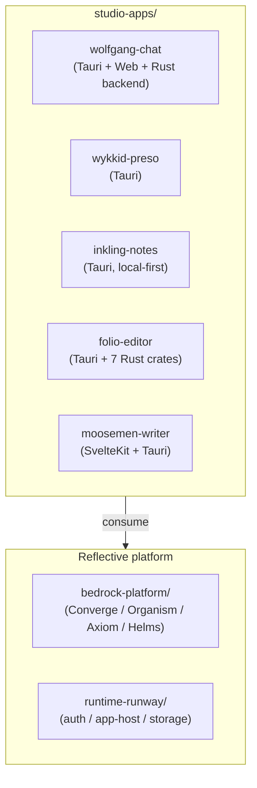

# studio-apps — Architecture Overview

<!-- @generated:start -->

Per its own README:

> *"Studio apps are creative, research, notes, writing, and presentation products in the Reflective workspace. They are separate from `../marquee-apps/`, which is reserved for thin JTBD commercial proof apps."*
> — `studio-apps/README.md:3-4`

Meta-workspace of **5 sub-apps**, each its own repo / project. Wolfgang Chat is the flagship (319 source files; over 6× the second-largest by file count).

## Stack composition

Scan at commit `e3359ad` (working tree dirty): Markdown 303 files (34.4%), JavaScript 299 (33.9%), Rust 127 (14.4%), TypeScript 79 (9.0%), Svelte 66 (7.5%), Shell 6, Python 2.

Web + desktop dominant; Wolfgang's Tauri-v2 + SvelteKit + Rust-backend pattern is the most replicated shape.

## The 5 sub-apps

### Wolfgang Chat — `wolfgang-chat/` (319 files)

> *"Wolfgang is the researcher chat app: an AI workspace powered by Professor Wolfgang, a contrarian German psychology scholar who challenges your thinking instead of agreeing with it. Wolfgang runs as a desktop app (macOS, Linux) and a web app (`app.wolfgang.bot`), backed by a shared Rust core with RAG-powered knowledgebase search."*
> — `studio-apps/wolfgang-chat/README.md:1-2`

Multi-target monorepo. Structure:

- `apps/desktop/` — Tauri v2 desktop shell
- `apps/web/` — SvelteKit web product (target host: `app.wolfgang.bot`)
- `backend/` — Rust HTTP + gRPC, deployed to Cloud Run
- `crates/wolfgang-core/` — shared LLM / RAG / personas Rust crate
- `packages/ui/` — shared Svelte components + theme
- `proto/` — gRPC definitions
- `infra/` — Terraform modules (GCP)
- `Justfile` task runner

This pattern (Tauri + SvelteKit + Rust crates + proto + Terraform) is the **studio-apps reference shape**.

### Wykkid Preso — `wykkid-preso/` (107 files)

Tauri desktop with SvelteKit frontend at root (no `apps/` subdir like Wolfgang). Per `studio-apps/README.md:19`, positioned as "Presentation and persuasion support" (`confidence: speculation` — no product-level README yet). Tauri shell at `src-tauri/Cargo.toml:4` is described only as "Wykkid Desktop".

### Inkling Notes — `inkling-notes/` (77 files)

> *"Inkling is a local-first desktop app for reading, writing, importing, and enriching Markdown notes in an Obsidian-compatible vault. The brand: an inkling is the half-formed thought at the moment of capture."*
> — `studio-apps/inkling-notes/README.md:1-2`

Structure:

- `src/` — SvelteKit frontend
- `src-tauri/` — Tauri desktop shell + Rust commands
- `crates/notes/` — application-level capture library
- `examples/` — capture CLI and extraction examples
- `kb/` — project Obsidian vault

### Folio Editor — `folio-editor/` (69 files)

Project codename: "Newspaper". From `studio-apps/folio-editor/kb/README.md:6-8`:

> *"Local Information Operating System. Domain knowledge for the Local Information Operating System. This `kb/` folder is the vault: it holds both the product spine docs and the deeper reference notes those docs assume."*
> (`confidence: speculation` — root README.md is missing; quote is from the project KB)

Rust workspace monorepo with Tauri desktop and 7 Rust crates: `newspaper-{domain,kernel,truths,app,platform,server}` + `apps/desktop/src-tauri`. Lede engagement-specific material at `project/` (Sölvesborg pilot).

### Moosemen Writer — `moosemen-writer/` (7 files)

> *"Moosemen Writer is an AI-powered writing companion that takes a book from idea to published. It covers the full lifecycle: research collection, story structure, persona planning, geographic mapping, nickname registries, editing assistance, and deadline accountability."*
> — `studio-apps/moosemen-writer/AGENTS.md:10-11`

SvelteKit + Tauri at `apps/desktop/`. No root Cargo.toml; build via Bun/TypeScript. Smallest scan footprint — early-stage scaffold.

## How studio-apps fits in the stack

Boundary vs. marquee-apps: studio = creative/research/personal-knowledge surfaces; marquee = thin JTBD commercial proof apps.

## Personas

Inferred from product framing; `confidence: speculation` except where README states.

- **Researcher** (Wolfgang Chat — stated as "researcher chat app")
- **Note-taker / knowledge worker** (Inkling — stated "local-first desktop app for reading, writing, importing, and enriching Markdown notes")
- **Presenter / communicator** (Wykkid Preso)
- **Editorial reviewer / information triager** (Folio Editor — stated direction from kb)
- **Writer / author** (Moosemen — stated "AI-powered writing companion that takes a book from idea to published")

## Module index (sub-app deep-dives)

- [[wolfgang-chat/Architecture - Overview|wolfgang-chat]] — Tauri v2 desktop + SvelteKit web + Rust HTTP/gRPC backend (Cloud Run) + shared core crates + Terraform infra. The canonical studio-apps shape. Deep dive includes 5 module notes (Desktop, Web, Backend, Core, Infra). Drift flagged: backend still depends on retired `converge-runtime` crate + bypasses commerce-rails for Stripe.

Wykkid Preso, Inkling Notes, Folio Editor, and Moosemen Writer are not yet deep-dived. To add one, run `/obsidian-architect` against `studio-apps/<sub-app>/`.

## Boundary

Owns: creative/research/personal-knowledge product surfaces, per-app domain state, local-first storage where applicable.
Does NOT own: thin JTBD commercial surfaces (→ [[../marquee-apps/Architecture - Overview|marquee-apps]]), governance contracts (→ [[../bedrock-platform/Architecture - Converge|Converge]]), runtime plumbing (→ [[../runtime-runway/Architecture - Overview|runtime-runway]]).

## Cross-references

- [[../current-system-map|Current System Map]]
- [[../marquee-apps/Architecture - Overview|marquee-apps]] — sibling, JTBD/commercial
- [[../mobile-apps/Architecture - Overview|mobile-apps]] — native iOS/Android surfaces (Inkling, Wolfgang are explicit mobile candidates)
- [[../bedrock-platform/Architecture - Overview|bedrock-platform]] — the platform these apps consume
- [[../README|04-architecture]] — domain hub

<!-- @generated:end -->
