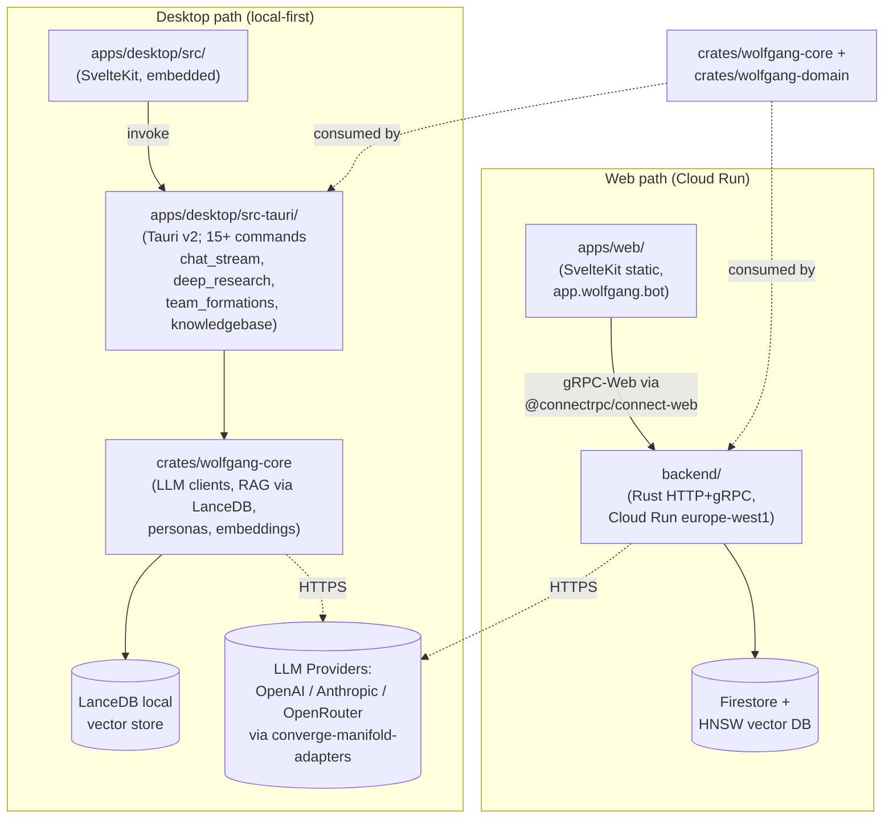

# wolfgang-chat — Architecture Overview

<!-- @generated:start -->

Per its own README:

> *"Wolfgang is the researcher chat app: an AI workspace powered by Professor Wolfgang, a contrarian German psychology scholar who challenges your thinking instead of agreeing with it. Wolfgang runs as a desktop app (macOS, Linux) and a web app (`app.wolfgang.bot`), backed by a shared Rust core with RAG-powered knowledgebase search."*
> — `studio-apps/wolfgang-chat/README.md:1-2`

The flagship [[../Architecture - Overview|studio-apps]] sub-project (319 source files, the largest by far). Workspace version `1.2.0` (edition 2024, MSRV 1.94). The Tauri+SvelteKit+Rust pattern documented here is the **studio-apps reference shape** that smaller siblings (Inkling, Folio, Moosemen, Wykkid) follow.

## Stack composition

Scan at commit `e3359ad` (dirty working tree at scan time):

- **Cargo workspace** (4 members):
  - `crates/wolfgang-core` — shared LLM / RAG / personas Rust library
  - `crates/wolfgang-domain` — domain models + Organism integration
  - `backend/` — Rust HTTP + gRPC (Cloud Run)
  - `apps/desktop/src-tauri` — Tauri v2 desktop shell
- **JS workspaces** (Bun-managed; `package.json` declares `apps/* + packages/*`):
  - `apps/web/` — SvelteKit static site, target `apps.reflective.se/wolfgang-chat/**`
  - `packages/ui/` — `@wolfgang/ui` shared Svelte component library
- **Proto definitions:** `proto/` — `document.proto`, `search.proto`, `common.proto`
- **Infrastructure:** `infra/` — Terraform (GCP, 6 modules)
- **CI:** `.github/workflows/{ci,release,deploy-web-v2}.yml`

## Two parallel compute paths

The most important architectural decision: **desktop and web are two distinct runtime topologies that share Rust core code but not compute**.

Desktop is **local-first** — it runs the LLM/RAG stack in-process via Tauri commands; LanceDB stores vectors on disk; user content stays on the device. Web is **cloud-deployed** — SvelteKit static frontend talks gRPC-Web (Connect-RPC) to the Cloud Run backend, which holds Firestore + an HNSW vector store. Both paths share `wolfgang-core` (LLM clients, personas, embeddings, knowledge contracts) and `wolfgang-domain` (Organism integration types).

## Platform dependencies

Wolfgang consumes the Reflective platform stack:

- **Converge** crates (`v3.9.2` head, but Wolfgang pins specific versions via workspace deps): kernel, model, pack, provider, **runtime** ⚠, storage, manifold-adapters.
- **Organism** (`v1.9.3` head): pack, runtime.
- **Runtime Runway**: `runway-auth`, `runway-middleware`, `runway-telemetry`.

⚠ **Discovered drift:** Wolfgang's backend Cargo.toml still pulls in the `converge-runtime` crate (with the Firebase feature) for HTTP auth, despite the 2026-06-02 [[../../decisions/2026-06-02-converge-runtime-retirement|converge-runtime retirement]]. The migration path is documented in the [[Architecture - Backend|Backend]] note.

## Module index

- [[Architecture - Desktop]] — `apps/desktop/` Tauri v2 shell + 15+ Tauri commands
- [[Architecture - Web]] — `apps/web/` SvelteKit + `packages/ui/` shared components
- [[Architecture - Backend]] — `backend/` Rust HTTP+gRPC service + `proto/` definitions
- [[Architecture - Core]] — `crates/wolfgang-core` + `crates/wolfgang-domain` shared libraries
- [[Architecture - Infra]] — `infra/` Terraform (GCP)

## Personas

Quoted/inferred from `README.md` and source structure; `confidence: stated` for the chat persona, `speculation` for the user personas.

- **Professor Wolfgang** (the chat persona, stated) — a contrarian German psychology scholar who challenges your thinking. Multiple `PersonaMode` variants in `wolfgang-core/src/persona.rs`.
- **Researcher / knowledge worker** — the target user; uses RAG over uploaded documents + URL ingestion for grounded chat (Tauri commands `import_knowledgebase`, `upload`, `start_deep_research_run`).
- **Web user** (cloud path) — signed in via Firebase Auth; subscribes via Stripe; uses the same product over the web.

## Boundary

Wolfgang sits at the **product surface** layer of [[../../current-system-map|current-system-map]]:

- Owns: product UX, conversation state, persona definitions, knowledge ingestion + retrieval policies, brand customization, billing-checkout flow.
- Does NOT own: governance (→ [[../../bedrock-platform/Architecture - Converge|Converge]]), formation selection (→ [[../../bedrock-platform/Architecture - Organism|Organism]]), commercial contracts (→ [[../../commerce-rails/Architecture - Overview|commerce-rails]] — though Wolfgang currently uses `async-stripe` directly in its backend; see [[Architecture - Backend|Backend]] note for that drift too), runtime plumbing (→ [[../../runtime-runway/Architecture - Overview|runtime-runway]]).

## Cross-references

- [[../Architecture - Overview|studio-apps overview]]
- [[../../current-system-map|Current System Map]]
- [[../../bedrock-platform/Architecture - Overview|bedrock-platform]] — Wolfgang's platform foundation
- [[../../runtime-runway/Architecture - Overview|runtime-runway]] — auth + middleware Wolfgang's backend consumes
- [[../../decisions/2026-06-02-converge-runtime-retirement|2026-06-02 retirement ADR]] — Wolfgang has remaining migration debt here

<!-- @generated:end -->
